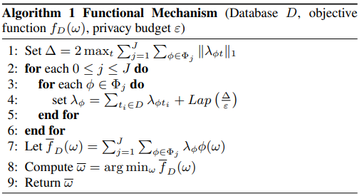

# What is it?

This is an implementation of fbar in Algorithm 1 of the paper titled: 

Functional Mechanism: Regression Analysis under Differential Privacy [Zhang et al., 2012] Jun Zhang, Zhenjie Zhang, Xiaokui Xiao, Yin Yang, and Marianne Winslett.

It achieves $\epsilon$-differential privacy in context of linear regression by injecting noise into the MSE loss function.

I have also included a short example similar to the section 4.2 'Application to Linear Regression'.
